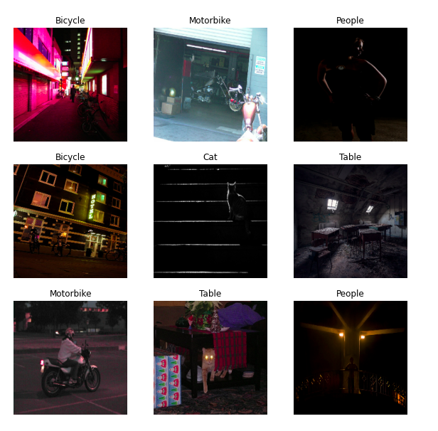
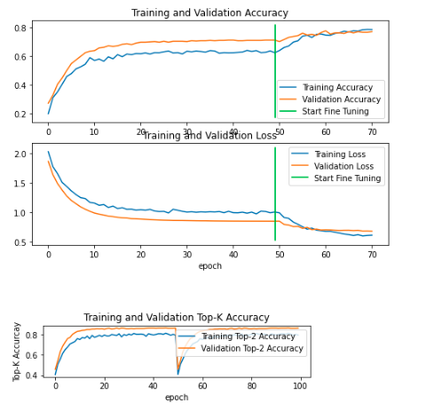
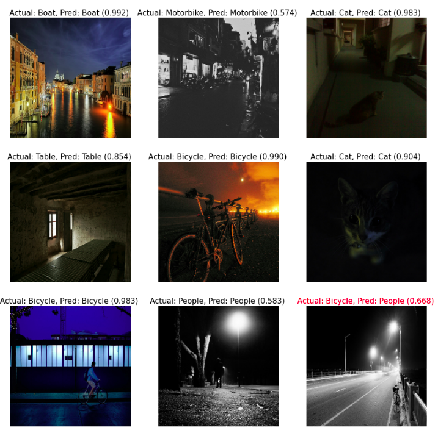

# Image Classification
Train a neural network model on the collected data Dataset consists of 2400 total images distributed across the training, validation and test set.


## Dataset:

Dataset consists of 3 folders Training, Validation and Testing which have 6 different classes:

   1. Bicycle
   2. Boat
   3. Cat
   4. Motorbike
   5. People
   6. Table
   
 Dataset Distribution:

|# of Image| Part |
|---|---| 
| 1447  | Training |
|   487  | Validation |
|  481  | Testing |


|# of Training Image| Class |
|---|---| 
| 241|  Table|
| 241| People|
|241| Motorbike|
|241 |Cat
|241| Boat||
|241| Bicycle| 


|# of Validation Image| Class |
|---|---| 
| 81|  Table |
| 81| People |
|81| Motorbike |
|81 |Cat |
|81| Boat |
|81| Bicycle |

 
| # of Testing Image|
|---|
| 480 |
    | -- Train
            | -- images
            | -- masks
    | -- Test
            | -- images
            | -- masks





## Model:
1. Transfer Learning: Trained on Multiple-backbone Model of input-dim: (224,224,3)  

2. Jupyter Notebook, `Kaggle-training.ipyb`: Model Trained and Inference in Kaggle GPU Notebook

3. Results:




## Inference Image



## Requirements
Python 3.7.8, TensorFlow 2.5, and other common packages listed in `requirements.txt`.


## Installation
1. Clone this repository
2. Install dependencies
   ``` pip3 install -r requirements.txt ```
3. Run setup from the repository root directory
    ``` python3 setup.py install ``` 

